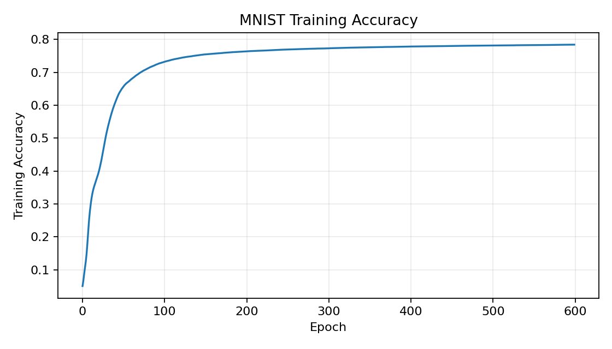
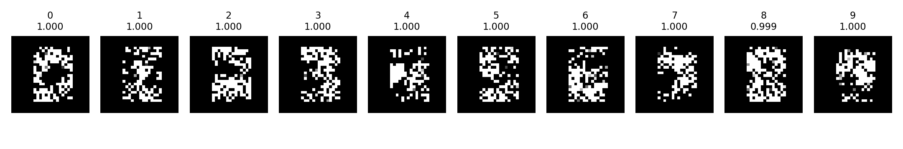

# MNIST MLP Activation Maximization

This project trains a small neural network on MNIST digits using only NumPy, then asks the trained model what input image would strongly activate each output digit.

The result is a compact end-to-end demo:

1. Load MNIST CSV data.
2. Train a one-hidden-layer MLP.
3. Save the trained weights.
4. Plot training accuracy.
5. Generate one activation-maximized image for each digit `0-9`.

## How It Works

The model is a simple MLP:

```text
784 input pixels -> 10 ReLU hidden units -> 10 softmax outputs
```

After training, activation maximization starts from random pixels and repeatedly adjusts the image to increase the target digit's output probability. Simple MNIST-inspired priors keep the result centered and remove faint pixels, so the final images show what the network looks for when it predicts each digit.

## Run

The MNIST CSV files are included in `data/`, so the full pipeline can be run directly:

```bash
python main.py
```

## Outputs

The run saves:

```text
outputs/models/mnist_weights.npz
outputs/plots/training_accuracy.png
outputs/plots/deep_dream_digits.png
```

Training accuracy:



What the neural network sees for each digit:



## Project Structure

```text
src/dataset.py      Load MNIST and optional noise data
src/model.py        NumPy MLP forward pass
src/train.py        Training loop and gradient descent
src/utils.py        Softmax, ReLU, derivatives, and accuracy
src/deep_dream.py   Activation maximization for digit images
src/inference.py    Weight loading and drawing UI helpers
main.py             Reproducible end-to-end pipeline
```


